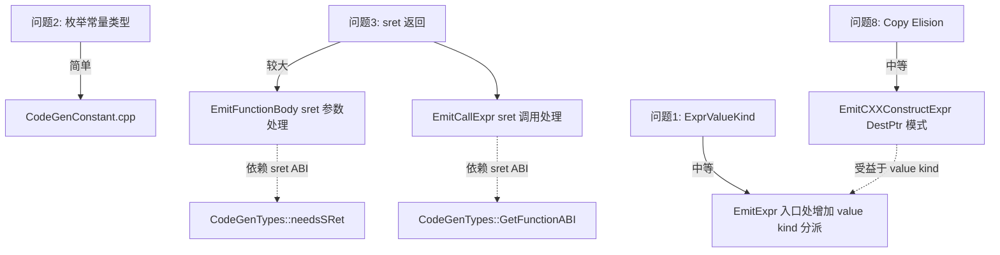

## 产品概述

修复 AUDIT 文档中 4 个 CodeGen 层问题，提升表达式求值正确性和结构体返回值支持。

## 核心特性

1. **枚举常量类型修复 (P1)**: CodeGenConstant.cpp 中枚举常量硬编码 i32，改用 ConvertType 获取底层类型
2. **ExprValueKind 感知 (P1)**: 在 EmitExpr 中利用 AST 已有的 getValueKind() 判断 lvalue/rvalue，对 lvalue 表达式统一走 EmitLValue+load 路径，消除 EmitLValue/EmitExpr 的重复逻辑
3. **结构体 sret 返回 (P2)**: EmitFunctionBody 处理 sret 隐式参数和 void 返回；EmitCallExpr 为 sret 函数传入缓冲区指针
4. **Copy Elision (P2)**: EmitCXXConstructExpr 支持在指定地址直接构造，避免临时对象 + load 的冗余

## 技术栈

- C++ 编译器项目，使用 LLVM 18 作为后端
- 当前架构：Parse → Sema → AST → CodeGen(LLVM IR)

## 问题分析与解决方案

### 问题 2: 枚举常量类型硬编码 (P1) — 简单修复

**根因**: `CodeGenConstant.cpp:49-50` 中枚举常量使用 `llvm::Type::getInt32Ty()` 而非 `ConvertType(ECD->getType())`。注意 `EmitDeclRefExpr` 中已修复（行 409-415），但常量求值路径未修复。

**方案**: 将 `llvm::Type::getInt32Ty(getLLVMContext())` 替换为 `CGM.getTypes().ConvertType(ECD->getType())`，fallback 到 i32。

**修改文件**: `src/CodeGen/CodeGenConstant.cpp`

### 问题 1: ExprValueKind 感知 (P1) — 中等改动

**根因**: CodeGen 完全不使用 AST 已有的 `getValueKind()`。当前方案用两个独立函数 `EmitExpr()`/`EmitLValue()`，调用方手动选择。EmitLValue 和 EmitExpr 对 DeclRefExpr/MemberExpr/ArraySubscriptExpr 有大量重复分支逻辑。

**方案**: 在 `EmitExpr` 入口处增加 value kind 感知逻辑：

- 对 `isGLValue()` 的表达式，统一调用 `EmitLValue` + `CreateLoad` 返回值
- 对 `isPRValue()` 的表达式，保持现有逻辑不变
- 移除 EmitExpr 中对 DeclRefExpr(MemberExpr/ArraySubscriptExpr) 的 load 逻辑（已在 EmitLValue 中有对应处理），改为统一走 EmitLValue 路径

**影响**: 需要仔细确认 EmitExpr 中各表达式分支哪些已经是 lvalue、哪些是 rvalue，避免 double-load。

**修改文件**: `src/CodeGen/CodeGenFunction.cpp`, `src/CodeGen/CodeGenExpr.cpp`

### 问题 3: 结构体 sret 返回 (P2) — 较大改动

**根因**: sret 机制已在 CodeGenTypes/CodeGenModule 中正确实现（隐式首参数、属性设置），但 CodeGenFunction 中的 `EmitFunctionBody` 和 `EmitCallExpr` 未适配。

**需要修复 3 处**:

1. **`EmitFunctionBody`** (`CodeGenFunction.cpp:40-117`):

- 检查当前函数是否需要 sret: `CGM.getTypes().needsSRet(ReturnType)`
- 若需要 sret: ReturnValue 使用 sret 参数（第 0 个参数）而非 alloca；返回时 `CreateRetVoid()` 而非 `CreateRet(load)`
- 参数映射需跳过 sret 隐式首参数：ArgIndex 起始偏移 +1

2. **`EmitCallExpr`** (`CodeGenExpr.cpp:752-868`):

- 检查被调函数是否需要 sret: 查询 `GetFunctionABI(CalleeDecl)->RetInfo.isSRet()`
- 若需要 sret: 创建临时 alloca 作为缓冲区，作为第 0 个参数传入，调用后从缓冲区 load 返回值

3. **AUDIT 文档更新**: 标记问题 3 为已修复

**修改文件**: `src/CodeGen/CodeGenFunction.cpp`, `src/CodeGen/CodeGenExpr.cpp`, `docs/dev status/PHASE6-6.2-AUDIT.md`

### 问题 8: Copy Elision (P2) — 中等改动

**根因**: `EmitCXXConstructExpr` 总是创建临时 alloca + 构造 + load 返回。对于 `T x = T(args)` 这种 prvalue 初始化场景，应直接在目标变量 `x` 的 alloca 上构造。

**方案**:

- 给 `EmitCXXConstructExpr` 增加 `llvm::Value *DestPtr` 参数（可选，默认 nullptr）
- 当 DestPtr 非空时，直接在 DestPtr 上调用构造函数，返回 DestPtr（作为指针）
- 在 `EmitVarDecl` 中，如果变量初始化器是 CXXConstructExpr（prvalue），直接传入变量的 alloca 作为 DestPtr
- 当 DestPtr 为 nullptr 时（现有行为），保持临时 alloca + load 的方式

**修改文件**: `src/CodeGen/CodeGenExpr.cpp`, `include/blocktype/CodeGen/CodeGenFunction.h`, `src/CodeGen/CodeGenStmt.cpp`(EmitVarDecl 相关部分)

## 架构关系



## 实施顺序

1. 先修问题 2（最小改动，无依赖）
2. 再修问题 1（ExprValueKind 感知，后续问题依赖）
3. 再修问题 3（sret 返回值处理）
4. 最后修问题 8（Copy Elision，依赖 value kind 感知）

## 目录结构

```
project-root/
├── src/CodeGen/
│   ├── CodeGenConstant.cpp      # [MODIFY] 问题2: 枚举常量使用 ConvertType 获取底层类型
│   ├── CodeGenFunction.cpp      # [MODIFY] 问题1: EmitExpr 入口增加 value kind 分派; 问题3: EmitFunctionBody sret 参数/返回处理
│   ├── CodeGenExpr.cpp          # [MODIFY] 问题1: 移除 EmitExpr 中 lvalue 分支的冗余 load; 问题3: EmitCallExpr sret 调用; 问题8: EmitCXXConstructExpr DestPtr
│   ├── CodeGenStmt.cpp          # [MODIFY] 问题8: EmitVarDecl 传入 DestPtr 实现 copy elision
├── include/blocktype/CodeGen/
│   └── CodeGenFunction.h        # [MODIFY] 问题8: EmitCXXConstructExpr 声明增加 DestPtr 参数
├── docs/dev status/
│   └── PHASE6-6.2-AUDIT.md      # [MODIFY] 更新问题 2/3 的状态
```