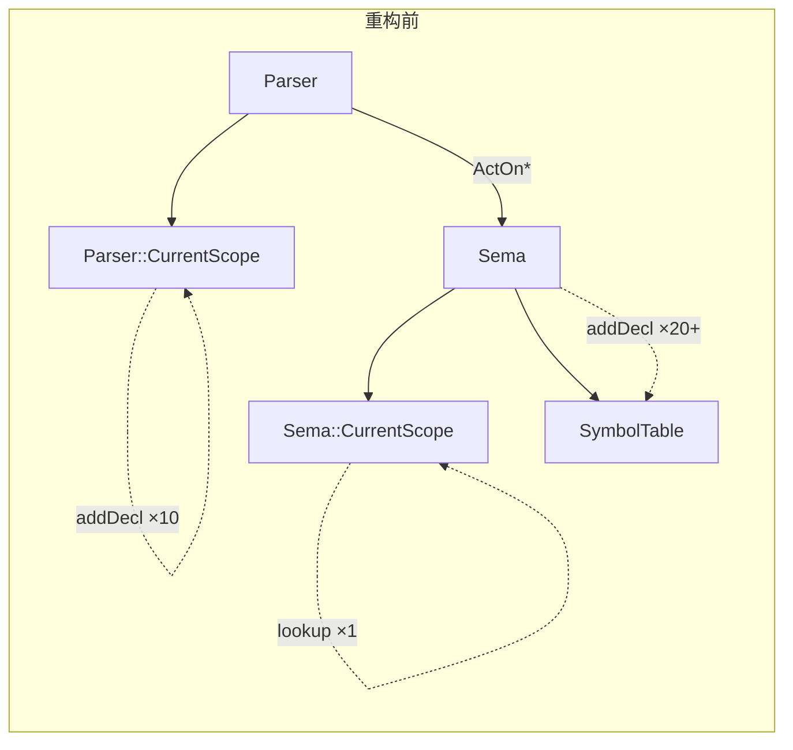
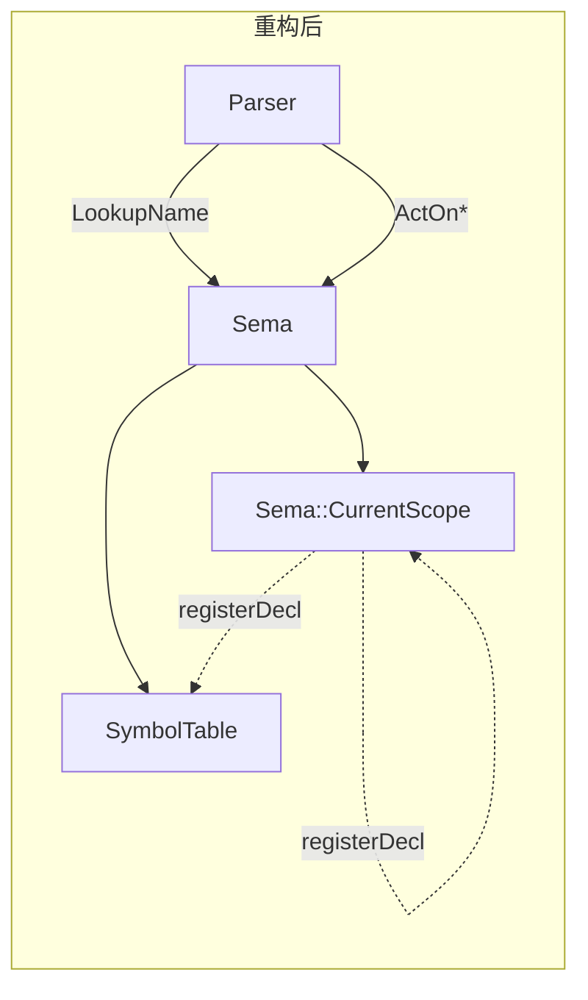

## 用户需求

将 Scope 管理从 Parser 统一到 Sema。当前 Parser 和 Sema 各自维护独立的 `CurrentScope`，存在双重 Scope 系统、双重声明注册、Parser 直接做 lookup 等架构问题。

## 产品概述

重构 BlockType 编译器的 Scope 管理架构，使 Parser 不再直接管理 Scope，而是通过 Sema 接口做名称解析和声明注册。Parser 仅负责语法解析，Sema 负责所有语义上下文。

## 核心功能

- **统一 Scope 链**：删除 Parser 独立的 `CurrentScope`，所有 Scope 生命周期由 Sema 管理
- **统一名称查找**：Parser 中 17 处 `CurrentScope->lookup()` 替换为 `Sema::LookupName()` 调用
- **统一声明注册**：Parser 中 10 处 `CurrentScope->addDecl()` 替换为 Sema 内部注册
- **统一 Scope 生命周期**：Parser 的 `pushScope/popScope` 委托给 `Sema::PushScope/PopScope`
- **保持向后兼容**：分 5 个阶段增量实施，每阶段编译通过且 662 测试全通过

## 技术栈

C++ 编译器项目（BlockType），LLVM 基础设施。修改涉及 Parser（6 个 .cpp）和 Sema（2 个 .cpp + 2 个 .h）。

## 实现方案

### 核心问题

```
Parser::CurrentScope ←→ Sema::CurrentScope   （两条独立的 Scope 链）
Parser::CurrentScope->lookup() ×17 处          （Parser 绕过 Sema 做查找）
Parser::CurrentScope->addDecl() ×10 处         （双重注册）
Sema::Symbols.addDecl() ×20+ 处               （只注册到 SymbolTable，不注册到 Scope）
```

### 策略

采用 5 阶段增量迁移：先让 Sema 的 Scope 链具备完整数据（Phase 1），再将 Parser 的查找/注册逐步重定向到 Sema（Phase 2-3），最后统一 Scope 生命周期并清理（Phase 4-5）。

### 阶段设计

**Phase 1 — Sema 填充 CurrentScope**

当前 Sema 的 ActOn 方法只将声明注册到 `Symbols`（全局符号表），不注册到 `CurrentScope`（词法作用域链）。需要同时注册到两者。

方案：在 Sema 中添加辅助方法 `registerDecl()`，替换所有 `Symbols.addDecl()` 调用：

```cpp
// Sema.h 新增
void registerDecl(NamedDecl *ND);           // addDecl + Symbols.addDecl
void registerDeclAllowRedecl(NamedDecl *ND); // addDeclAllowRedeclaration + Symbols.addDecl
```

涉及 Sema.cpp 中约 20+ 处 `if (CurrentScope) Symbols.addDecl(...)` 替换为 `registerDecl(...)`。

**Phase 2 — Sema::LookupName + 替换 Parser 查找**

新增 `Sema::LookupName()` 方法，先查 Scope 链（词法作用域），再回退到 SymbolTable：

```cpp
NamedDecl *Sema::LookupName(llvm::StringRef Name) const;
```

然后替换 Parser 中 17 处 `CurrentScope->lookup()` 调用：

| 文件 | 调用数 | 行号 |
| --- | --- | --- |
| ParseExpr.cpp | 7 | 928, 945, 988, 1005, 1030, 1056, 1069 |
| ParseType.cpp | 2 | 109, 167 |
| ParseStmt.cpp | 1 | 72 |
| ParseTemplate.cpp | 5 | 88, 108, 132, 211, 245, 642, 845 |


**Phase 3 — 移除 Parser addDecl 调用**

Parser 中 10 处 `CurrentScope->addDecl()` 和 1 处 `addDeclAllowRedeclaration()` 全部删除，因为 Sema 的 ActOn 方法已在 Phase 1 中负责注册。

| 文件 | 调用 | 行号 |
| --- | --- | --- |
| Parser.cpp | `addDecl(ND)` | 50 |
| ParseClass.cpp | `addDecl(Class/Struct/Union)` | 80, 158, 209 |
| ParseClass.cpp | `addDecl(Method/VD/Ctor/Dtor)` | 622, 654, 827, 860 |
| ParseTemplate.cpp | `addDeclAllowRedeclaration(P)` | 171 |


**Phase 4 — 统一 Scope 生命周期**

Parser 的 `pushScope/popScope` 委托给 Sema：

```cpp
void Parser::pushScope(ScopeFlags Flags) {
  Actions.PushScope(Flags);
  CurrentScope = Actions.getCurrentScope(); // 保持同步
}
void Parser::popScope() {
  Actions.PopScope();
  CurrentScope = Actions.getCurrentScope();
}
```

同时移除 `parseTranslationUnit` 中多余的 TU scope push（Sema 构造函数已创建）。

**Phase 5 — 移除 Parser::CurrentScope**

删除 `Parser::CurrentScope` 成员、`pushScope/popScope` 方法、`getCurrentScope()` 访问器。Parser 完全通过 `Actions` 接口访问 Scope。

### 架构设计





### 目录结构

```
project-root/
├── include/blocktype/
│   ├── Parse/Parser.h              # [MODIFY] Phase 4-5: 修改 pushScope/popScope，最终移除 CurrentScope
│   └── Sema/
│       ├── Sema.h                  # [MODIFY] Phase 1: 添加 registerDecl/LookupName 声明
│       └── Scope.h                 # [不变]
├── src/
│   ├── Parse/
│   │   ├── Parser.cpp              # [MODIFY] Phase 3-4: 移除 addDecl，修改 pushScope/popScope
│   │   ├── ParseExpr.cpp           # [MODIFY] Phase 2: 替换 7 处 lookup
│   │   ├── ParseType.cpp           # [MODIFY] Phase 2: 替换 2 处 lookup
│   │   ├── ParseStmt.cpp           # [MODIFY] Phase 2: 替换 1 处 lookup
│   │   ├── ParseClass.cpp          # [MODIFY] Phase 3: 移除 7 处 addDecl
│   │   └── ParseTemplate.cpp       # [MODIFY] Phase 2-3: 替换 5 处 lookup，移除 1 处 addDecl
│   └── Sema/
│       └── Sema.cpp                # [MODIFY] Phase 1: registerDecl 辅助方法 + 20+ 处替换
└── tests/                          # [不变] 每阶段 662 测试全通过
```

### 实现注意事项

- **Phase 1 关键**：`Scope::addDecl()` 在名称重复时返回 false 且不添加。对模板参数需使用 `addDeclAllowRedeclaration()` 避免阻止同名参数注册
- **Phase 2 关键**：`Sema::LookupName()` 需先查 Scope 链（`CurrentScope->lookup()` 已递归查父作用域），再回退到 SymbolTable（覆盖前向声明等边缘情况）
- **Phase 4 关键**：`parseTranslationUnit()` 不能再 push TU scope，因为 Sema 构造函数已创建。需直接使用 Sema 现有的 TU scope
- **性能**：Scope 链查找是 O(depth × avg_names_per_scope)，与当前 Parser 行为一致，无性能退化
- **爆炸半径控制**：每个 Phase 独立编译测试，任一阶段失败不进入下一阶段